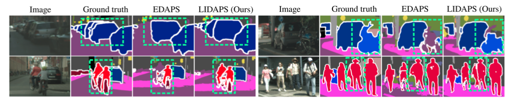

## Language-Guided Instance-Aware Domain-Adaptive Panoptic Segmentation : LIDAPS
Code release for the paper [**Language-Guided Instance-Aware Domain-Adaptive Panoptic Segmentation**](https://arxiv.org/abs/2404.03799) WACV 2025. <br>
**Authors**: Elham Amin Mansour, Ozan Unal, Suman Saha, Benjamin Bejar, Luc Van Gool <br>
**Abstract**: The increasing relevance of panoptic segmentation is tied to the advancements in autonomous driving and AR/VR applications. However, the deployment of such models has been limited due to the expensive nature of dense data annotation, giving rise to unsupervised domain adaptation (UDA). A key challenge in panoptic UDA is reducing the domain gap between a labeled source and an unlabeled target domain while harmonizing the subtasks of semantic and instance segmentation to limit catastrophic interference. While considerable progress has been achieved, existing approaches mainly focus on the adaptation of semantic segmentation. In this work, we focus on incorporating instance-level adaptation via a novel instance-aware cross-domain mixing strategy IMix. IMix significantly enhances the panoptic quality by improving instance segmentation performance. Specifically, we propose inserting high-confidence predicted instances from the target domain onto source images, retaining the exhaustiveness of the resulting pseudo-labels while reducing the injected confirmation bias. Nevertheless, such an enhancement comes at the cost of degraded semantic performance, attributed to catastrophic forgetting. To mitigate this issue, we regularize our semantic branch by employing CLIP-based domain alignment (CDA), exploiting the domain-robustness of natural language prompts. Finally, we present an end-to-end model incorporating these two mechanisms called LIDAPS, achieving state-of-the-art results on all popular panoptic UDA benchmarks.

### News
**\[2024-11\]** LIDAPS is accepted at WACV 2025! <br>



### Installation
for the installation please refer to EDAPS

## Running on Synthia to cityscapes
### warmup with EDAPS* + CDA 
```shell
python run_experiments.py --exp 741 --machine local
```
### refinement with EDAPS* + CDA + mixing
```shell
python run_experiments.py --exp 691 --machine local
```

### for evaluating on LIDAPS synthia to cityscape on the best LIDAPS model(out of 3 runs)
```shell
python run_experiments.py --exp 611 --machine local
```